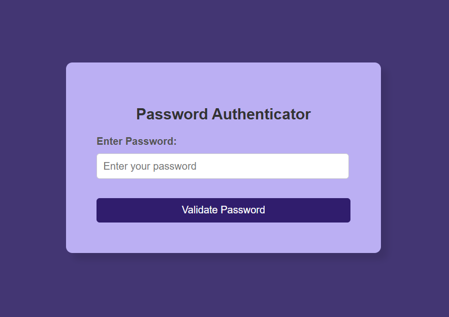

# Password Authenticator Tool

This repository contains a Password Authenticator Tool designed to assess the strength of passwords entered by users. The tool provides real-time feedback on password strength based on length, complexity, and uniqueness. It aims to guide users to create stronger, more secure passwords through an interactive and user-friendly interface.



## Table of Contents

- [Introduction](#introduction)
- [Features](#features)
- [Live Demo](#live-demo)
- [Technologies Used](#technologies-used)
- [Setup and Installation](#setup-and-installation)
- [Usage](#usage)
- [How It Works](#how-it-works)
- [Contributing](#contributing)
- [License](#license)

## Introduction

The Password Authenticator Tool is a lightweight and intuitive web-based tool for evaluating the strength of user passwords. It helps users ensure their passwords meet security best practices by analyzing length, the inclusion of uppercase and lowercase letters, special characters, and numbers. The tool provides real-time feedback to encourage secure password creation.

## Features

- **Real-Time Feedback**: Displays the password strength dynamically as the user types.
- **Color-Coded Feedback**: Indicates password strength (weak, moderate, or strong) using color-coded text for better visual understanding.
- **Strength Evaluation**: Checks for essential password components such as:
  - Length
  - Uppercase and lowercase letters
  - Numbers
  - Special characters
- **Suggestions for Improvement**: Provides actionable tips to improve weak passwords.

## Live Demo
You can access the live version of the Password Authenticator here:  
[Password Authenticator Live Demo](https://lishaangral.github.io/password-authenticator/)

## Technologies Used

- **Frontend**:
  - HTML
  - CSS
  - JavaScript

## Setup and Installation

1. Clone the repository to your local machine:
   ```bash
   git clone https://github.com/your-username/password-authenticator-tool.git
   ```
2. Navigate to the project directory:
   ```bash
   cd password-authenticator-tool
   ```
3. Open the `index.html` file in your web browser to start using the tool:
   ```bash
   open index.html
   ```

## Usage

1. **Open the Tool**: Launch the `index.html` file in your browser.

2. **Enter a Password**:

   - Type a password into the input field.
   - The tool will evaluate the password's strength in real-time.

3. **View Feedback**:

   - Feedback text will display one of three strength levels:
     - **Weak**: Indicates that the password lacks essential components.
     - **Moderate**: Indicates that the password is relatively secure but can be improved.
     - **Strong**: Indicates that the password meets all security criteria.

4. **Follow Suggestions**:
   - If the password is weak or moderate, suggestions will appear below the input field to help improve its strength.

## How It Works

1. **Password Analysis**:

   - The password is checked for the following:
     - Length (minimum of 8 characters recommended)
     - Uppercase and lowercase letters
     - Numbers
     - Special characters (e.g., `@`, `#`, `$`)

2. **Real-Time Feedback**:

   - A JavaScript function dynamically evaluates the password as the user types.
   - The evaluation score determines whether the password is categorized as **Weak**, **Moderate**, or **Strong**.

3. **Color-Coded Feedback**:

   - The tool uses predefined CSS classes (`feedback-weak`, `feedback-moderate`, `feedback-strong`) to change the feedback text color:
     - Weak: Red
     - Moderate: Orange
     - Strong: Green

4. **Suggestions for Improvement**:
   - Suggestions are displayed based on missing criteria, such as adding special characters or increasing length.

## Example Output

- **Password Entered**: `12345`

  - **Feedback**: "Password is weak. Suggestions:
    - Add more characters (minimum 8).
    - Include special characters (e.g., `@`, `#`).
    - Add uppercase and lowercase letters."

- **Password Entered**: `P@ssw0rd123`
  - **Feedback**: "Password is strong!"

## Contributing

Contributions are welcome! If you would like to improve the tool or add new features, feel free to fork the repository and submit a pull request. Before contributing:

- Follow best practices for coding and documentation.
- Test your changes thoroughly.

## License

This project is licensed under the MIT License. See the [LICENSE](LICENSE) file for more information.

---
